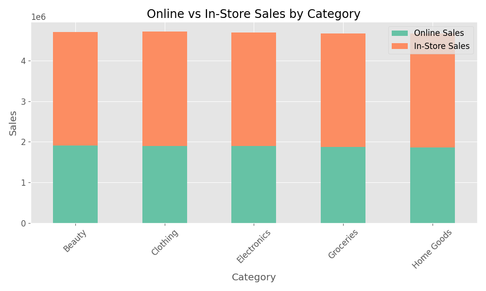
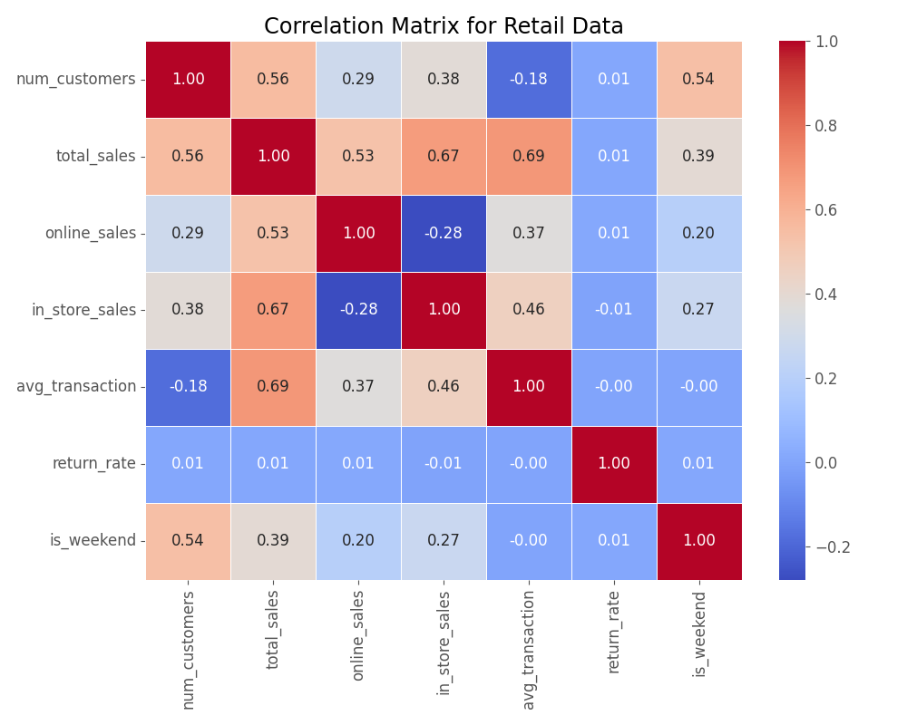

# Exploratory Data Analysis (EDA) Report

This report summarizes the exploratory data analysis performed on the retail sales and product review datasets. The analysis includes data overviews, visualizations, and key insights.

## Data Sources

*   `data/raw/retail_sales_data.csv`
*   `data/raw/product_reviews.csv`

## Retail Sales Data Overview

```text
Shape: (18250, 13)

First 5 rows:
         date store_id     category  ... in_store_sales avg_transaction return_rate
0  2023-01-01  store_1  Electronics  ...         979.68           10.29      0.0453
1  2023-01-01  store_1     Clothing  ...         374.07           13.90      0.0407
2  2023-01-01  store_1    Groceries  ...        1138.92           10.89      0.0793
3  2023-01-01  store_1   Home Goods  ...        1535.66           13.31      0.0442
4  2023-01-01  store_1       Beauty  ...        1078.67           14.71      0.0234

[5 rows x 13 columns]

Data types:
date                   object
store_id               object
category               object
weather                object
promotion              object
special_event          object
dominant_age_group     object
num_customers         float64
total_sales           float64
online_sales          float64
in_store_sales        float64
avg_transaction       float64
return_rate           float64
dtype: object

Missing values:
date                     0
store_id                 0
category                 0
weather                346
promotion             3881
special_event          382
dominant_age_group     388
num_customers          398
total_sales            358
online_sales           354
in_store_sales         388
avg_transaction        374
return_rate            357
dtype: int64

Summary statistics:
       num_customers   total_sales  online_sales  in_store_sales  avg_transaction   return_rate
count   17852.000000  17892.000000  17896.000000    17862.000000     17876.000000  17893.000000
mean      106.242382   1311.541712    526.816265      785.157977        12.482732      0.049979
std        24.347909    418.386731    323.639622      370.713369         3.311998      0.020041
min        51.000000    250.010000      2.000000       13.260000         2.620000     -0.026900
25%        89.000000   1015.697500    286.060000      517.352500        10.130000      0.036400
50%       102.000000   1257.690000    469.340000      737.240000        12.210000      0.050000
75%       119.000000   1539.222500    701.555000      998.587500        14.550000      0.063400
max       285.000000   4202.360000   3371.680000     3178.170000        27.860000      0.136600
```

## Retail Sales Analysis

### Key Insights

*   Total number of records: 18250
*   Date range: 2023-01-01 to 2023-12-31
*   Number of stores: 10
*   Number of categories: 5
*   Average sales: $1311.54
*   Average online sales proportion: 40.18%
*   Most common weather condition: Sunny
*   Most common promotion type: Flash Sale
*   Most common dominant age group: 55+

### Visualizations

**1. Total Sales by Category**


**2. Online vs In-Store Sales by Category**


**3. Average Sales by Weather Condition**


**4. Average Sales by Promotion Type**


**5. Average Sales by Dominant Age Group**


**6. Monthly Sales Trend**


**7. Average Return Rate by Category**


**8. Total Sales by Store**


**9. Correlation Matrix**


## Product Reviews Data Overview

```text
Shape: (1000, 9)

First 5 rows:
  review_id           product     category  ...  attribute_mentioned        date sentiment
0  REV14165       TechPro X20  Smartphones  ...               design  2023-03-09  positive
1  REV81426       TechPro X20  Smartphones  ...               design  2023-10-28  positive
2  REV54597    SmartWatch Pro    Wearables  ...           durability  2023-03-09  positive
3  REV89131  SmartSpeaker 360   Smart Home  ...         connectivity  2022-12-19  positive
4  REV92397   HomeConnect Hub   Smart Home  ...               design  2022-10-28  positive

[5 rows x 9 columns]

Data types:
review_id              object
product                object
category               object
rating                  int64
review_text            object
feature_mentioned      object
attribute_mentioned    object
date                   object
sentiment              object
dtype: object

Missing values:
review_id              0
product                0
category               0
rating                 0
review_text            0
feature_mentioned      0
attribute_mentioned    0
date                   0
sentiment              0
dtype: int64

Summary statistics:
       review_id     product category  ...  attribute_mentioned        date sentiment
count       1000        1000     1000  ...                 1000        1000      1000
unique       996          25        5  ...                   15         537         3
top     REV88579  DevBook 13    Audio  ...               design  2022-04-03  positive
freq           2          49      206  ...                  161           7       584
mean         NaN         NaN      NaN  ...                  NaN         NaN       NaN
std          NaN         NaN      NaN  ...                  NaN         NaN       NaN
min          NaN         NaN      NaN  ...                  NaN         NaN       NaN
25%          NaN         NaN      NaN  ...                  NaN         NaN       NaN
50%          NaN         NaN      NaN  ...                  NaN         NaN       NaN
75%          NaN         NaN      NaN  ...                  NaN         NaN       NaN
max          NaN         NaN      NaN  ...                  NaN         NaN       NaN

[11 rows x 9 columns]
```

## Product Reviews Analysis

### Key Insights

*   Total number of reviews: 1000
*   Number of unique products: 25
*   Number of categories: 5
*   Average rating: 3.74
*   Most common sentiment: positive
*   Most mentioned feature: battery life
*   Most mentioned attribute: design
*   Date range: 2022-01-01 to 2023-12-31

### Visualizations

**1. Rating Distribution**


**2. Sentiment Distribution**


**3. Average Rating by Product Category**


**4. Top 10 Mentioned Features**


**5. Top 10 Mentioned Attributes**


**6. Sentiment Distribution by Product Category**


**7. Average Rating Trend Over Time**

