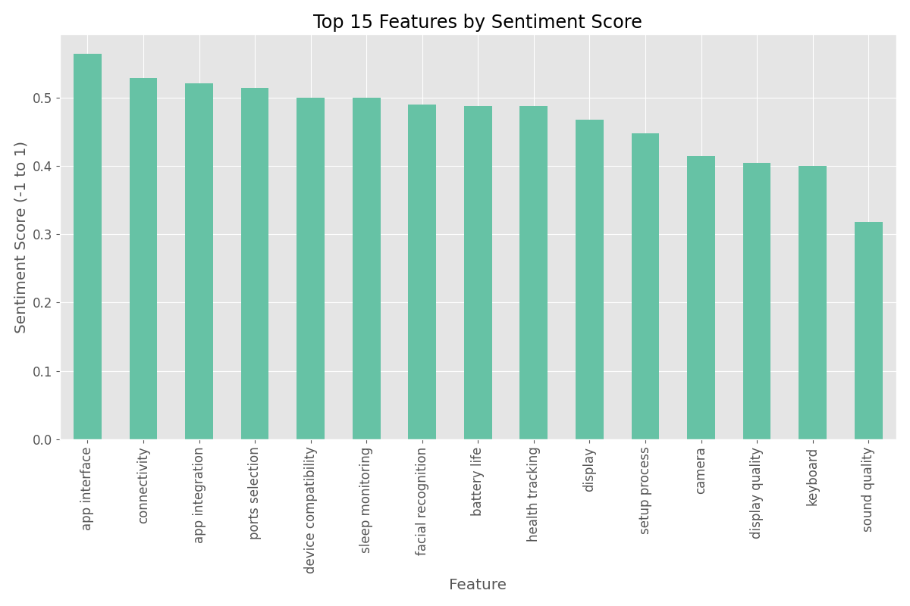
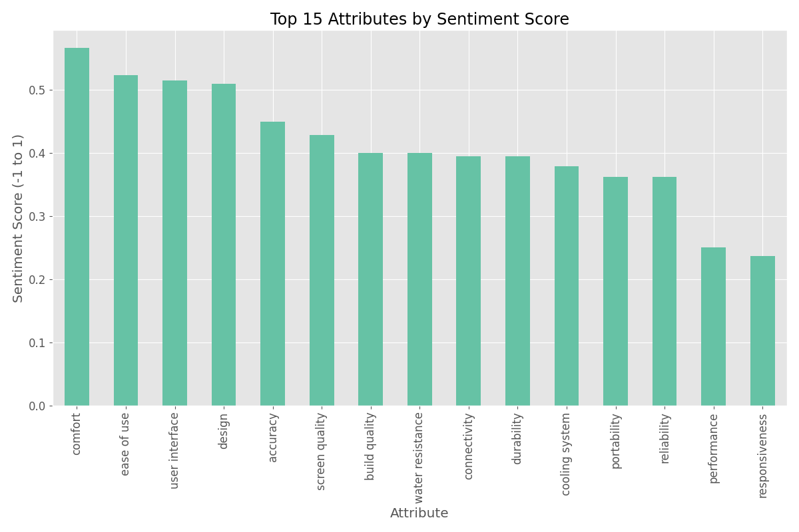
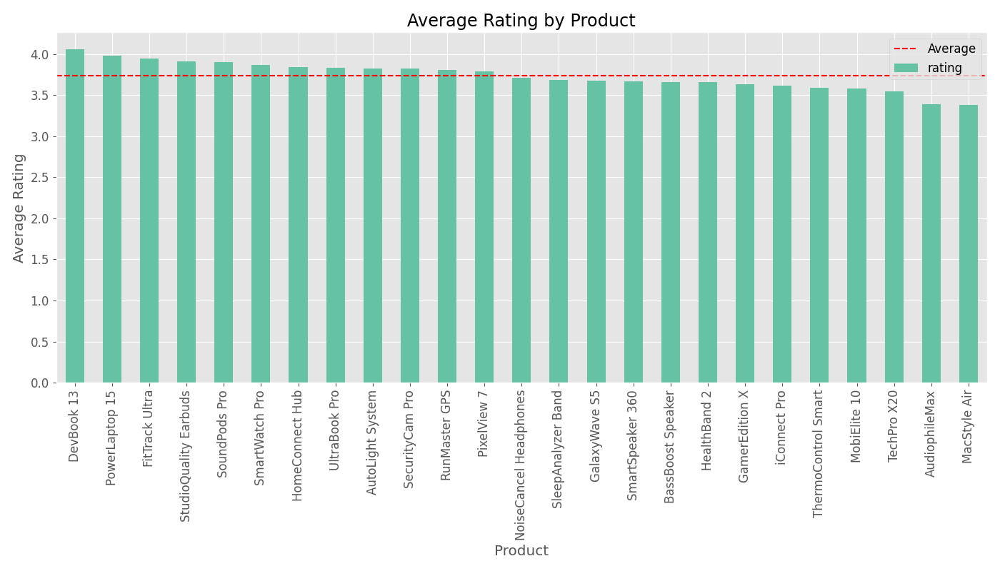
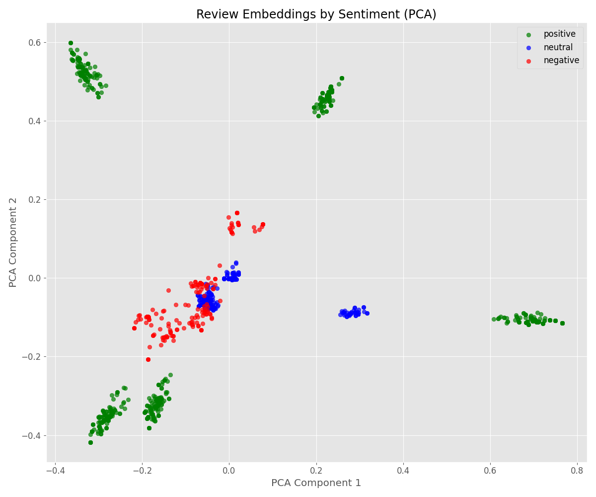
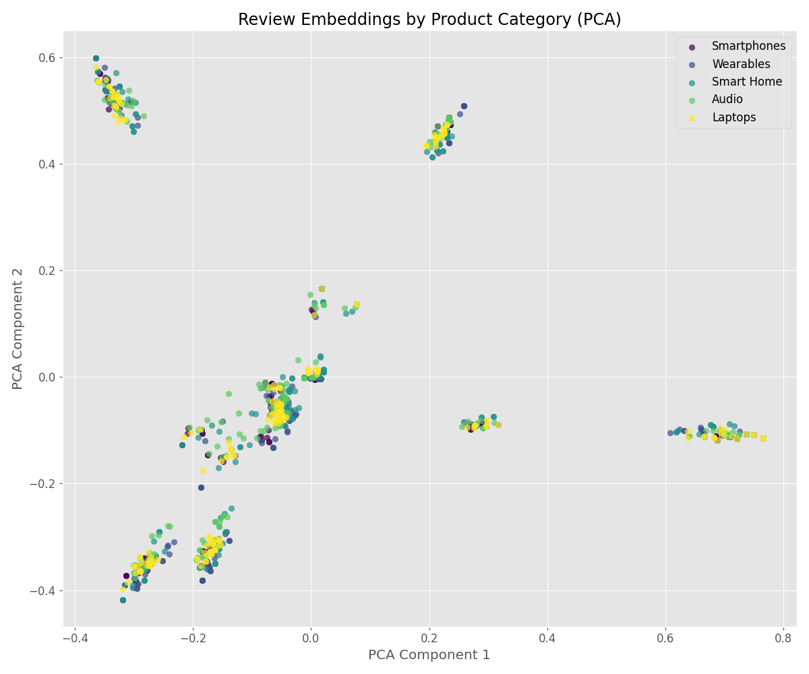
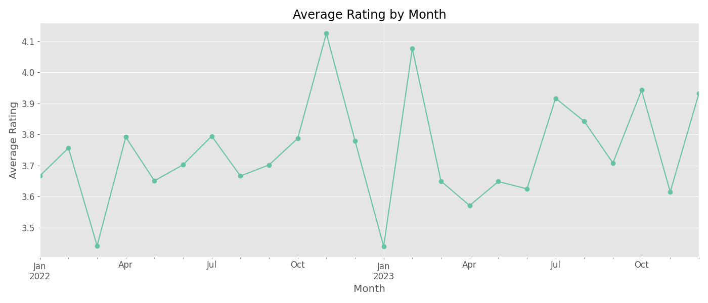
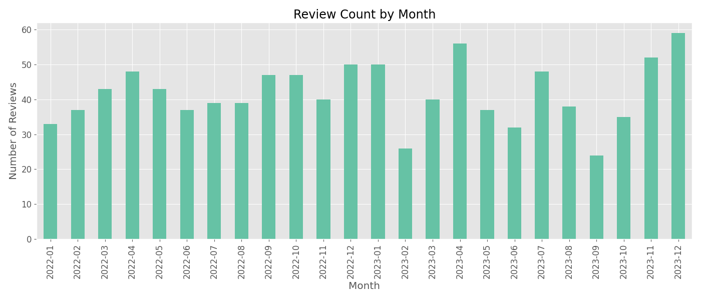
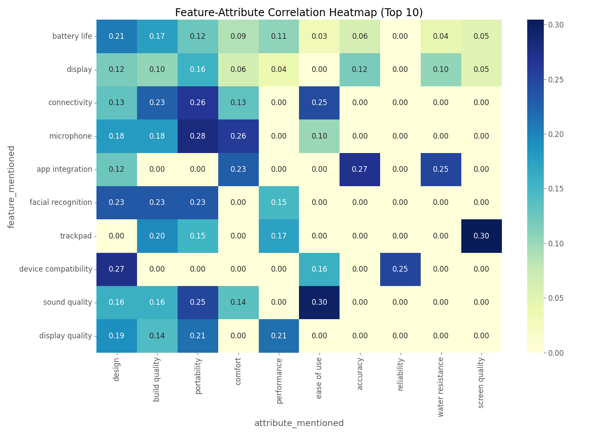

# Product Review Analysis and RAG Simulation Report

This report details the analysis performed on product reviews, including sentiment analysis, feature/attribute extraction, vector embeddings, and a simulation of Retrieval-Augmented Generation (RAG) for generating product insights and comparisons.

## Data Source

*   `data/raw/product_reviews.csv`

## Initial Data Overview (Terminal Output)

```text
=== Product Review Analysis ===
Total reviews: 1000
Unique products: 25
Categories: 5
Rating distribution:
rating
1     94
2     69
3    127
4    426
5    284
Name: count, dtype: int64
Sentiment distribution:
sentiment
positive    584
neutral     253
negative    163
Name: count, dtype: int64
```

## Analysis Steps

1.  **Text Preprocessing:** Review text was converted to lowercase, and special characters/numbers were removed.
2.  **Feature/Attribute Sentiment Analysis:** Calculated sentiment scores for mentioned features and attributes.
3.  **Product-Level Analysis:** Calculated average ratings and sentiment distributions per product. Identified top strengths and weaknesses based on feature/attribute mentions in positive/negative reviews.
    <details>
    <summary>Click to view Strengths/Weaknesses Terminal Output</summary>

    ```text
    Product Insights (Strengths and Weaknesses):

    --- DevBook 13 ---
      Strengths:
        Features: battery life, trackpad, display
        Attributes: build quality, performance, screen quality
      Weaknesses:
        Features: trackpad, battery life, ports selection
        Attributes: performance, portability, screen quality

    --- PowerLaptop 15 ---
      Strengths:
        Features: display, keyboard, trackpad
        Attributes: portability, cooling system, performance
      Weaknesses:
        Features: trackpad, display, keyboard
        Attributes: build quality, screen quality

    --- FitTrack Ultra ---
      Strengths:
        Features: app integration, display, health tracking
        Attributes: accuracy, water resistance, durability
      Weaknesses:
        Features: display, sleep monitoring, health tracking
        Attributes: water resistance, durability, accuracy

    --- StudioQuality Earbuds ---
      Strengths:
        Features: connectivity, microphone, sound quality
        Attributes: design, portability, ease of use
      Weaknesses:
        Features: connectivity, noise cancellation, battery life
        Attributes: design, build quality, portability

    --- SoundPods Pro ---
      Strengths:
        Features: connectivity, microphone, sound quality
        Attributes: comfort, portability, design
      Weaknesses:
        Features: noise cancellation, sound quality, microphone
        Attributes: design, build quality, ease of use
    ```
    </details>

4.  **Vector Embeddings:** Generated TF-IDF vectors for review text.
5.  **Vector Search:** Implemented a simple cosine similarity search to find reviews similar to a query.
    <details>
    <summary>Click to view Vector Search Example Output</summary>

    ```text
    Example vector search:
    Query: 'battery life problems'
    Top 5 similar reviews:
    1. Product: HealthBand 2, Rating: 1, Sentiment: negative
    2. Product: PixelView 7, Rating: 1, Sentiment: negative
    3. Product: TechPro X20, Rating: 1, Sentiment: negative
    4. Product: HealthBand 2, Rating: 1, Sentiment: negative
    5. Product: TechPro X20, Rating: 1, Sentiment: negative
    ```
    </details>
6.  **Embedding Visualization:** Used PCA to visualize review embeddings in 2D, colored by sentiment and category.
7.  **Temporal Analysis:** Analyzed average ratings and review counts over time (monthly).
8.  **Feature-Attribute Correlation:** Analyzed the co-occurrence of top features and attributes using a heatmap.
9.  **RAG Simulation:** Simulated RAG queries to generate detailed product insights and comparisons based on the analyzed data.
10. **Summary Generation:** Created and saved `category_summary.csv` and `product_summary.csv` to `data/processed/`.

## Key Visualizations

**1. Top 15 Features by Sentiment Score**


**2. Top 15 Attributes by Sentiment Score**


**3. Average Rating by Product**


**4. Review Embeddings by Sentiment (PCA)**


**5. Review Embeddings by Product Category (PCA)**


**6. Average Rating by Month**


**7. Review Count by Month**


**8. Feature-Attribute Correlation Heatmap (Top 10)**


## RAG Simulation Examples

**Example Query 1: Product Insights (DevBook 13)**
```text
Product Insights for DevBook 13:
- Average Rating: 4.06/5 (49 reviews)
- Sentiment: positive (77.6%), neutral (12.2%), negative (10.2%)
- Top Features: battery life, trackpad, keyboard, display, ports selection
- Top Attributes: build quality, performance, screen quality, portability, cooling system
- Strengths (Features): battery life, trackpad, display
- Weaknesses (Features): trackpad, battery life, ports selection
- Sample Positive: Absolutely love my new DevBook 13! The screen quality is top-notch and the keybo...
- Sample Negative: Disappointed with the DevBook 13. The ports selection constantly fails and the p...
```

**Example Query 2: Product Comparison (TechPro X20 vs GalaxyWave S5)**
```text
Comparison: TechPro X20 vs GalaxyWave S5
- Rating: 3.55 vs 3.67
- Positive Sentiment: 55.0% vs 55.8%
- Top Features (TechPro X20): battery life, facial recognition, camera
- Top Features (GalaxyWave S5): facial recognition, fast charging, display quality
- Verdict: GalaxyWave S5 rated higher by 0.12 points.
```

## Generated Summary Files & Output

*   `data/processed/category_summary.csv`
*   `data/processed/product_summary.csv`

**Category Summary (Terminal Output):**
```text
Category Summary:
               rating  review_count  negative   neutral  positive
category
Audio        3.708738           206  0.194175  0.233010  0.572816
Laptops      3.791262           206  0.155340  0.237864  0.606796
Smart Home   3.755319           188  0.143617  0.308511  0.547872
Smartphones  3.641791           201  0.189055  0.238806  0.572139
Wearables    3.788945           199  0.130653  0.251256  0.618090
```

**Top 5 Products by Rating (Terminal Output):**
```text
Top 5 Products by Rating:
                         rating  review_count   category  negative   neutral  positive
product
DevBook 13             4.061224            49    Laptops  0.102041  0.122449  0.775510
PowerLaptop 15         3.977778            45    Laptops  0.066667  0.333333  0.600000
FitTrack Ultra         3.947368            38  Wearables  0.105263  0.236842  0.657895
StudioQuality Earbuds  3.914286            35      Audio  0.114286  0.285714  0.600000
SoundPods Pro          3.900000            40      Audio  0.175000  0.175000  0.650000
```

This analysis provides a deeper understanding of customer feedback, highlighting key product aspects, sentiment trends, and enabling simulated RAG-based querying for insights.
