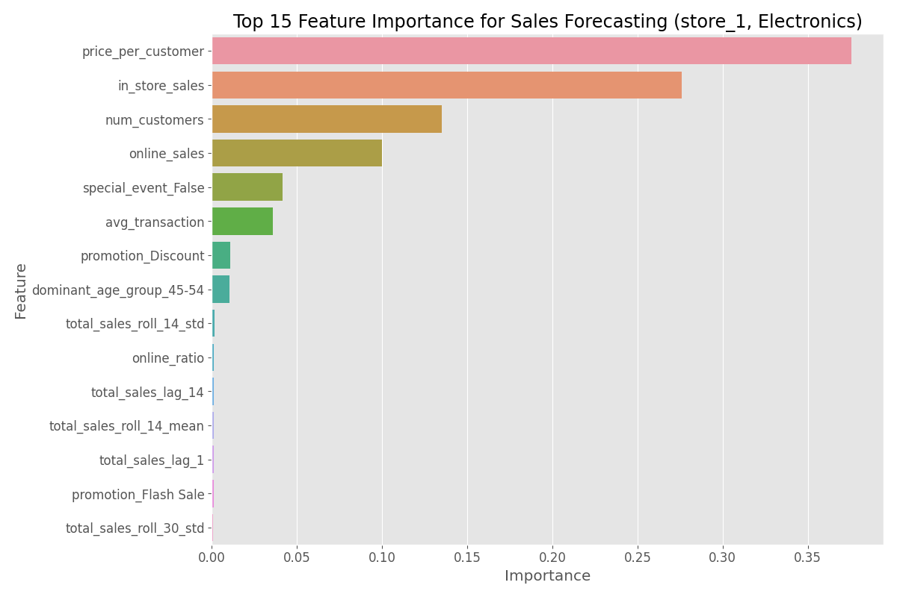
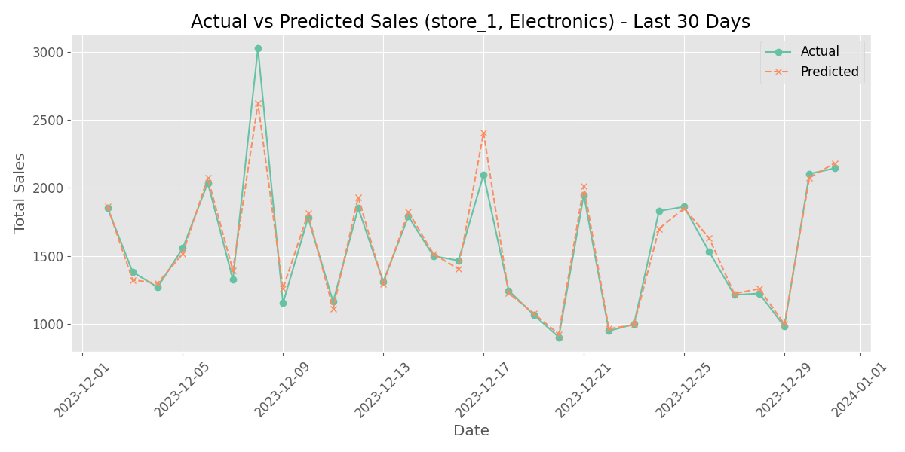
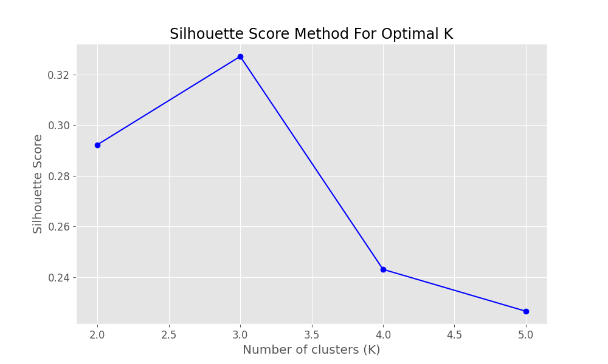
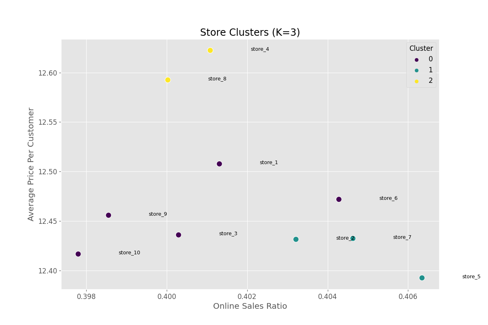
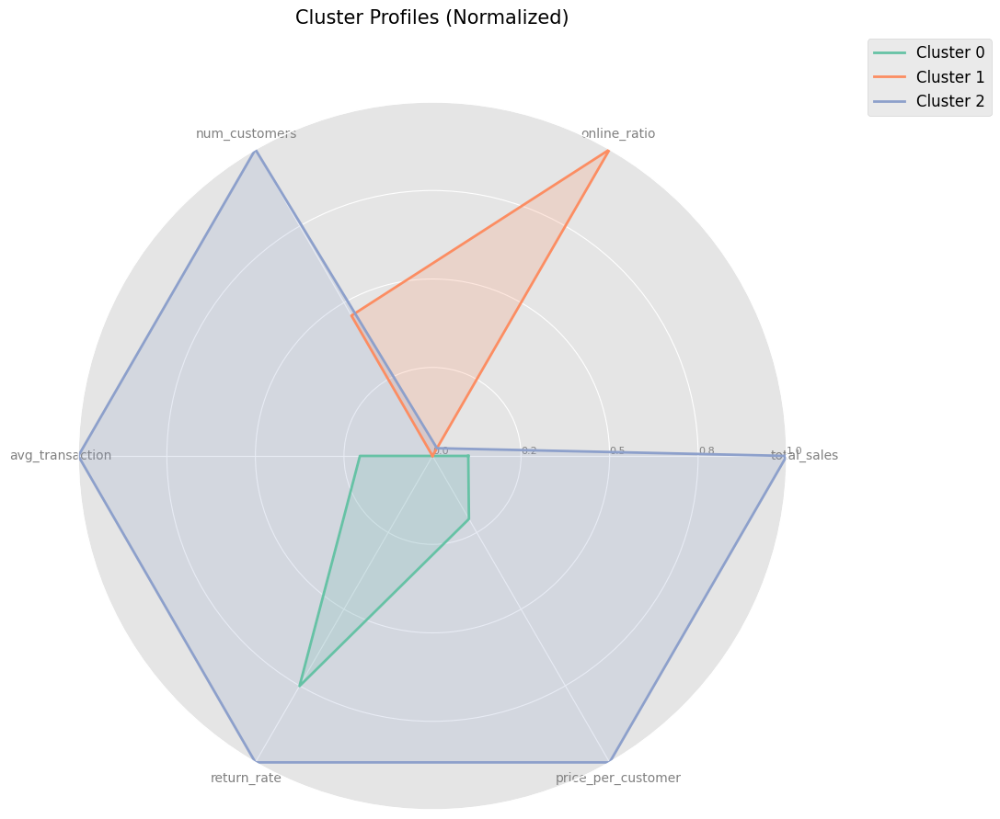

# Sales Forecasting and Customer Segmentation Report

This report summarizes the sales forecasting and store segmentation analysis performed using the retail sales data.

## Data Source

*   `data/raw/retail_sales_data.csv`

## Preprocessing and Feature Engineering

1.  **Temporal Features:** Added year, month, day, day_of_week, is_weekend, quarter.
2.  **Missing Value Imputation:** Filled missing categorical features with mode or 'None'/'False', and numerical features with the median.
3.  **Lag Features:** Created lag features (1, 7, 14 days) for `total_sales` per store/category.
4.  **Rolling Window Features:** Created rolling window features (7, 14, 30 days mean and std) for `total_sales` per store/category.
5.  **Interaction Features:** Created `price_per_customer`, `online_ratio`, `weekend_promotion`.
6.  **NaN Handling:** Dropped rows with NaNs resulting from lag/roll features.

**Preprocessing Output:**
```text
Handling missing values...
Missing values check after imputation:
Series([], dtype: int64)

Performing feature engineering...
Dropped 700 rows due to NaNs from lag/roll features.
Feature engineering completed. New shape: (17550, 31)
```

## Part 1: Sales Forecasting (Example: store_1, Electronics)

An XGBoost model was trained to forecast `total_sales` for a sample store and category combination (store_1, Electronics).

### Model Training & Performance (Terminal Output)

```text
Training forecasting model for store_1, Electronics...
  Fold 1/3...
  Fold 2/3...
  Fold 3/3...

Forecasting Model Metrics:
  MAE: 75.5870
  RMSE: 136.1652
  R2: 0.8950
```

### Key Visualizations

**1. Top 15 Feature Importance**


**2. Actual vs Predicted Sales (Last 30 Days)**


## Part 2: Customer Segmentation (Store Level)

K-Means clustering was applied to segment stores based on aggregated performance metrics.

### Determining Optimal Clusters (Terminal Output)

The Silhouette Score method was used to find the optimal number of clusters (K).

```text
Calculating silhouette scores for K=[2, 3, 4, 5]...
  K=2, Silhouette Score: 0.2923
  K=3, Silhouette Score: 0.3271
  K=4, Silhouette Score: 0.2431
  K=5, Silhouette Score: 0.2266
```



*   Optimal number of clusters found: 3

### Cluster Analysis

Stores were grouped into 3 clusters based on features like average sales, online ratio, customer count, transaction value, return rate, etc.

**Cluster Mean Values (Terminal Output):**
```text
Cluster Analysis (Mean Values):
   cluster  total_sales  online_sales  ...  price_per_customer  is_weekend  online_to_instore_ratio
0        0  1311.878817    524.355325  ...           12.457661    0.287749                 0.667023
1        1  1309.653293    531.186555  ...           12.418862    0.287749                 0.681861
2        2  1331.684838    531.918060  ...           12.607466    0.287749                 0.665679

[3 rows x 11 columns]
```

### Key Visualizations

**1. Store Clusters (Online Ratio vs Price Per Customer)**


**2. Cluster Profiles Radar Chart (Normalized)**


### Cluster Profiles (Terminal Output)

```text
Cluster Profiles:
Cluster 0:.
   Stores: store_1, store_10, store_3, store_6, store_9
Cluster 1:.
   Stores: store_2, store_5, store_7
Cluster 2:.
   Stores: store_4, store_8
```
*(Note: The script generated basic profile descriptions based on simple comparisons to the mean. Deeper analysis of the radar chart and mean values provides more nuanced profiles.)*

## Generated Summary File

*   `data/processed/store_clusters.csv`: Contains store features along with their assigned cluster label.

This analysis provides a baseline forecast model and identifies distinct store segments based on their operational characteristics.
